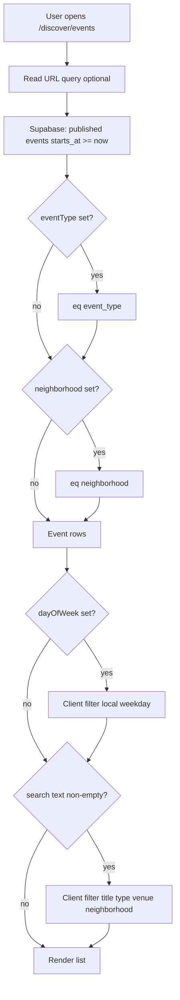

# Discover & Events filter UX — Web implementation guide

**Purpose:** Replicate the mobile **Discover** and **Events** filter UX on **customer web** (`app.wherethevibesat.com`). Hand this document to Cursor agents or web developers; read the Flutter files listed below before coding.

**Related:** [WEB_APP_BUILD_INSTRUCTIONS.md](../WEB_APP_BUILD_INSTRUCTIONS.md) §8 (Customer web), §11 (events + neighborhoods schema).

### Table of contents

1. [Problem (Discover)](#1-problem-do-not-replicate-on-web)
2. [UX principles](#2-ux-principles)
3. [Discover page (`/discover`)](#3-target-layout-on-discover)
4. [Discover Browse panel](#4-discover-browse-ui-secondary)
5. [Routes](#5-routes-and-query-params)
6. [Events page (`/discover/events`)](#6-events-browse-page-discoverevents) — **includes day-of-week**
7. [Filter pipeline & API](#7-filter-pipeline--api)
8. [Chip styling (monochrome theme)](#8-chip-styling-monochrome-theme)
9. [Web component tree](#9-suggested-web-component-tree-nextjs-example)
10. [Shared TypeScript](#10-shared-typescript-copy-from-flutter)
11. [Acceptance criteria](#11-acceptance-criteria)
12. [Out of scope](#12-out-of-scope-unless-requested)
13. [Cursor prompt](#13-prompt-snippet-for-cursor--contractors)
14. [Changelog](#14-changelog)

### Mobile source of truth (implemented)

| Flutter file | Role |
|--------------|------|
| `lib/screens/wtva/discover_screen.dart` | Discover page layout |
| `lib/widgets/wtva/discover_quick_browse.dart` | Events / Areas / Map shortcut row |
| `lib/screens/wtva/discover_browse_sheet.dart` | Discover Browse panel (event types + neighborhoods) |
| `lib/widgets/wtva/wtva_search_bar.dart` | Search field + filter affordance |
| `lib/widgets/wtva/wtva_category_chips.dart` | Primary venue category filters |
| `lib/screens/wtva/events_browse_screen.dart` | Events list + search + Filters button |
| `lib/screens/wtva/events_filters_sheet.dart` | Events Filters modal (type, day, neighborhood) |
| `lib/widgets/wtva/wtva_select_chip.dart` | Selectable pill chip (Browse + Filters modals) |
| `lib/data/mock_discover_data.dart` | Venue category labels |
| `lib/data/event_types.dart` | Canonical event type list |
| `lib/data/weekdays.dart` | Day-of-week filter ids + labels |
| `lib/services/neighborhoods_repository.dart` | Neighborhoods API |
| `lib/services/events_repository.dart` | Published events API |

---

## 1. Problem (do not replicate on web)

The **old** Discover layout exposed three horizontal chip rows under search:

1. “Browse by event type” (navigates away — does not filter the feed)
2. “Browse neighborhoods” (navigates away)
3. Venue categories: Nearest, Bars, Night clubs, Restaurants, Location (filters the feed)

Users could not tell which chips changed the list vs opened another screen. The header consumed too much vertical space before promoted venues and “Near you” content.

**Do not ship three always-visible chip carousels on `/discover`.**

---

## 2. UX principles

| Principle | Application |
|-----------|-------------|
| **One primary filter row** | Only controls that change the **current page’s venue list** stay visible (category chips). |
| **Progressive disclosure** | Event types and neighborhoods live in a **Browse** panel/sheet, not in the sticky header. |
| **Separate navigation from filtering** | Events and neighborhoods are **entry points** to other routes; venue categories are **in-place filters**. |
| **Consistent affordances** | Search bar **filter/tune** icon opens the same Browse UI as the **Areas** shortcut (with optional scroll-to section). |
| **Parity with mobile** | Same mental model across Flutter and web; responsive layout may differ (sheet vs dialog). |

---

## 3. Target layout on `/discover`

Top-to-bottom order in the Discover header region:

```
┌─────────────────────────────────────────────────────────┐
│ Discover                                    🔔  avatar  │
│ 📍 Houston, TX ▾                                        │
├─────────────────────────────────────────────────────────┤
│ [🔍 Search venues, events, people...        ] [⚙ tune] │  ← opens Browse
├─────────────────────────────────────────────────────────┤
│ [ Events ]    [ Areas ]    [ Map ]                      │  ← quick browse row
├─────────────────────────────────────────────────────────┤
│ (Nearest) (Bars) (Night clubs) (Restaurants) (Location) │  ← single chip row
├─────────────────────────────────────────────────────────┤
│ Promoted …                                              │
│ Near you …                                              │
│ (venue cards)                                           │
└─────────────────────────────────────────────────────────┘
```

### 3.1 Search bar

- **Tap/click field** → navigate to `/discover/search` (or focus inline search if you implement typeahead on the same page).
- **Filter (tune) button** → open **Discover Browse** UI (§4). Do **not** send filter-only users straight to the map unless product explicitly changes that.

Reference: `lib/widgets/wtva/wtva_search_bar.dart`

### 3.2 Quick browse row

Three equal-width tiles in one row:

| Tile | Label | Icon (Material) | Action |
|------|-------|-----------------|--------|
| 1 | **Events** | `event_outlined` | Navigate to `/discover/events` (no type pre-selected) |
| 2 | **Areas** | `place_outlined` | Open Discover Browse with `initialSection=areas` (§4) |
| 3 | **Map** | `map_outlined` | Navigate to `/discover/map` |

Styling (match design system):

- Background: `dark300` (`#2A2A2E` or token equivalent)
- Border: `night200` at ~85% opacity
- Radius: `12px`
- Padding: ~`10px` vertical; icon `20px`; label `12px` semibold `neutral100`

Reference: `lib/widgets/wtva/discover_quick_browse.dart`

### 3.3 Venue category chips (only visible filter row)

Horizontal scrollable chips; **one selected at a time**; selection updates the venue list on the same page.

| Index | Label | Behavior |
|-------|-------|----------|
| 0 | Nearest | Default; show all venues sorted by distance (or API default) |
| 1 | Bars | Filter venues where type/category = bar |
| 2 | Night clubs | Filter clubs |
| 3 | Restaurants | Filter restaurants |
| 4 | Location | Navigate to `/discover/map`; reset chip selection to Nearest when user returns |

**Data (v1 mock parity):** labels from `MockDiscoverData.categories` in `lib/data/mock_discover_data.dart`. **Production:** map to `venues.type` or a dedicated `venue_category` column — align with Supabase schema.

Selected chip: gradient primary button style (`buttonGradient` + shadow). Unselected: `dark400` fill, `night200` border.

Reference: `lib/widgets/wtva/wtva_category_chips.dart`

### 3.4 Below the header (unchanged)

- Promoted card
- “Near you” venue list (filtered by category chip)
- Live stories strip

---

## 4. Discover Browse UI (secondary)

Replaces the removed event-type and neighborhood chip rows on Discover.

### 4.1 Content

Two sections inside one scrollable container:

**Section A — Event type**

- Title: `Event type`
- Chips (wrap layout, not horizontal carousel):
  - `All events` → `/discover/events`
  - One chip per value in `WtvaEventTypes.all` (`lib/data/event_types.dart`):

```
Day Party
Night Party
After Hours
Brunch / Daytime
Live Music / DJ
Private Event
Other
```

Selecting a type → close panel → navigate to `/discover/events?type={encodeURIComponent(type)}`

**Section B — Neighborhood**

- Title: `Neighborhood`
- Load from Supabase `neighborhoods` table (`city`, `is_active = true`), same as `NeighborhoodsRepository.list()` in Flutter.
- Chips in a **wrap** (all neighborhoods visible by scrolling the panel — no second horizontal carousel on Discover).
- Selecting a neighborhood → close panel → navigate to `/discover/neighborhoods/[slug]` or `/discover/areas/[slug]` (pick one route pattern and stick to it).

**Empty state:** “No neighborhoods loaded yet.” if API returns `[]`.

### 4.2 `initialSection` behavior

When opened from **Areas** quick tile or filter button with `?section=areas`:

- Scroll/focus the Neighborhood section into view after open (mobile uses `Scrollable.ensureVisible`; web: `element.scrollIntoView({ behavior: 'smooth' })` or ref + `scrollIntoView`).

Allowed values: `events` | `areas` | omit for top of sheet.

Reference: `lib/screens/wtva/discover_browse_sheet.dart`

### 4.3 Responsive container

| Viewport | Container |
|----------|-----------|
| Mobile web (`< md`) | Bottom **sheet** / drawer from bottom, max height ~72vh, drag handle, close button |
| Desktop (`≥ md`) | **Modal dialog** centered, max-width ~480px, same content — or right **side panel** if design system prefers |

Use the same React component; swap wrapper (`Sheet` vs `Dialog`) via breakpoint.

**Do not** render Browse sections inline on `/discover` — always behind sheet/dialog.

---

## 5. Routes and query params

Add to customer web IA (extend [WEB_APP_BUILD_INSTRUCTIONS.md](../WEB_APP_BUILD_INSTRUCTIONS.md) §8.1):

| Route | Purpose | Flutter reference |
|-------|---------|-------------------|
| `/discover` | Main feed with layout in §3 | `discover_screen.dart` |
| `/discover/search` | Full search | `search_screen.dart` |
| `/discover/map` | Map + venue pins | `map_search_screen.dart` |
| `/discover/events` | Published events list | `events_browse_screen.dart` |
| `/discover/events?type=Night+Party` | Pre-filter by event type | `initialEventType` |
| `/discover/events?neighborhood=Downtown` | Pre-filter by neighborhood name | `initialNeighborhood` |
| `/discover/events?day=5` | Pre-filter by weekday (5 = Friday) | `dayOfWeek` — see §6.5 |
| `/discover/neighborhoods/:slug` | Venues/events in one neighborhood | `neighborhood_venues_screen.dart` |

**City picker:** keep existing pattern (`city_picker_sheet.dart`) — e.g. modal on city label click; Houston default for v1 demo data.

---

## 6. Events browse page (`/discover/events`)

Discover is decluttered; **all structural filters for events live in one Filters modal**, not as multiple chip rows on the page.

### 6.1 Layout

```
┌────────────────────────────────────────┐
│ ← Events                               │
├────────────────────────────────────────┤
│ [🔍 Search events, venues...]          │  ← always visible; live client-side filter
│ [ ⚙ Filters ]  or  [ ⚙ Filters (3) ]   │  ← opens modal; number = active filter count
├────────────────────────────────────────┤
│ (event cards)                          │
└────────────────────────────────────────┘
```

### 6.2 Filters modal

Opened by **Filters** button. Max height ~75vh; scrollable body; sticky **Apply filters** footer.

| Order | Section title | Chips |
|-------|---------------|-------|
| 1 | **Event type** | `All types` + each value in `EVENT_TYPES` (§10) |
| 2 | **Day of week** | `Any day` + `Mon` `Tue` `Wed` `Thu` `Fri` `Sat` `Sun` |
| 3 | **Neighborhood** | `All areas` + one chip per row from `neighborhoods` API |

**Header:** title `Filters`, text button **Clear all** (resets draft only), close (X).

**Footer:** full-width **Apply filters** — commits draft → closes modal → refetches/re-filters list.

**Draft state:** Changes inside the modal are **not** applied to the list until **Apply filters**. Closing via X or backdrop = discard draft (same as mobile).

**Do not** show inline horizontal chip carousels for type / day / neighborhood on the events page.

Reference: `lib/screens/wtva/events_filters_sheet.dart`

### 6.3 Search behavior (main page)

- Search input stays on the events page (not inside the modal).
- **Live filter** as the user types (no Apply needed for search).
- Case-insensitive match if **any** of these fields contains the query substring:
  - `title`
  - `event_type`
  - `venue.name` (joined)
  - `neighborhood`

Reference: `_applyClientFilters` in `lib/screens/wtva/events_browse_screen.dart`

### 6.4 Filter state model

Mirror Flutter `EventsFilters`:

| Field | Type | Default | Applied where |
|-------|------|---------|---------------|
| `eventType` | `string \| null` | `null` (= all types) | **Server** — Supabase `eq('event_type', …)` |
| `neighborhood` | `string \| null` | `null` (= all areas) | **Server** — Supabase `eq('neighborhood', …)` |
| `dayOfWeek` | `number \| null` | `null` (= any day) | **Client** — weekday of `starts_at` in user local TZ |

**Active filter count** (shown on button):

```ts
function activeFilterCount(f: EventsFilters): number {
  return (f.eventType ? 1 : 0) + (f.neighborhood ? 1 : 0) + (f.dayOfWeek ? 1 : 0);
}
```

`hasSelection` = count > 0. Button label: `Filters` or `Filters (${count})`.

### 6.5 Day of week rules

Use the same numbering as JavaScript / Dart **`Date.getDay()` is NOT the same** — use **ISO weekday**:

| Chip label | `dayOfWeek` value | Notes |
|------------|-------------------|-------|
| Any day | `null` | no day filter |
| Mon | `1` | Monday |
| Tue | `2` | … |
| Wed | `3` | |
| Thu | `4` | |
| Fri | `5` | |
| Sat | `6` | |
| Sun | `7` | Sunday |

**JavaScript** (no native ISO weekday on `Date`; use one of):

```ts
// Option A: Intl
function isoWeekday(date: Date): number {
  const day = date.getDay(); // 0=Sun … 6=Sat
  return day === 0 ? 7 : day;
}

// Option B: match Flutter WtvaWeekdays ids from §10
```

**Filter logic** (after events are loaded):

```ts
function matchesDayOfWeek(startsAt: string | Date, dayOfWeek: number | null): boolean {
  if (dayOfWeek == null) return true;
  const d = typeof startsAt === 'string' ? new Date(startsAt) : startsAt;
  return isoWeekday(d) === dayOfWeek;
}
```

Use the **browser/local timezone** when converting `starts_at` from UTC (Supabase stores timestamptz).

**URL param (recommended):** `?day=5` for Friday — sync on Apply so links are shareable.

### 6.6 End-to-end filter pipeline



### 6.7 Supabase query (server filters)

Align with `lib/services/events_repository.dart`:

```ts
let query = supabase
  .from('events')
  .select('id, title, event_type, neighborhood, starts_at, image_url, venue:venues(name)')
  .eq('status', 'published')
  .gte('starts_at', new Date().toISOString());

if (eventType) query = query.eq('event_type', eventType);
if (neighborhood) query = query.eq('neighborhood', neighborhood);

const { data } = await query.order('starts_at').limit(60);
```

Then run client steps for `dayOfWeek` and `search` in application code.

### 6.8 URL query params (recommended for web)

Sync when user taps **Apply filters** (and initialize page from URL on load):

| Param | Example | Maps to |
|-------|---------|---------|
| `type` | `Night+Party` | `eventType` |
| `neighborhood` | `Midtown` | `neighborhood` (name, not slug — matches mobile) |
| `day` | `5` | `dayOfWeek` (1–7) |
| `q` | `dj` | search text (optional; can stay local-only) |

Example: `/discover/events?type=Night+Party&day=5&neighborhood=Midtown`

Discover Browse panel navigates with `type` only: `/discover/events?type=Day+Party`.

---

## 7. Filter pipeline & API

| Data | Source | Server filter | Client filter |
|------|--------|---------------|---------------|
| Venue feed | `venues` | category, distance | — |
| Neighborhoods | `neighborhoods` (`city`, `is_active`) | — | — |
| Event types | static `EVENT_TYPES` | `event_type` column | — |
| Events list | `events` published, future `starts_at` | `event_type`, `neighborhood` | `dayOfWeek`, search `q` |
| Weekdays | static `WEEKDAYS` | — | `starts_at` weekday |
| Promoted / stories | mock / v2 | — | — |

---

## 8. Chip styling (monochrome theme)

WTVA uses a **black & white** theme. Do **not** use a purple selected state on the web unless tokens change.

| State | Background | Text |
|-------|------------|------|
| **Selected** | White gradient (`buttonGradient`) + subtle border/shadow | **Black** (`onPrimary` / `#000000`) |
| **Unselected** | `dark300` `#1C1C1C` | `neutral100` `#F4F4F5` |

**Important:** `accentPurple` in Flutter tokens is aliased to **white** (`#FFFFFF`). Selected chips with white text on white fill are invisible — always use **dark text on light selected chips**.

Use **wrap layout** for filter chips, not horizontal scroll carousels.

Reference: `lib/widgets/wtva/wtva_select_chip.dart`, `lib/widgets/wtva/wtva_category_chips.dart`

---

## 9. Suggested web component tree (Next.js example)

```
app/discover/page.tsx
  DiscoverHeader
    CityPickerTrigger
    SearchBar onSearchNavigate onFilterOpen
    DiscoverQuickBrowse
    VenueCategoryChips
  DiscoverFeed (promoted, venues, stories)

components/discover/
  SearchBar.tsx
  DiscoverQuickBrowse.tsx
  VenueCategoryChips.tsx
  DiscoverBrowsePanel.tsx    // sheet + dialog wrappers
  useDiscoverBrowse.ts       // open/close, initialSection

app/discover/events/page.tsx
  EventsSearchBar
  EventsFiltersButton
  EventsList
components/events/
  EventsFiltersModal.tsx      // draft state + Apply
  useEventsFilters.ts         // URL sync, activeCount
  filterEvents.ts             // dayOfWeek + search client filters
  fetchPublishedEvents.ts     // Supabase query

app/discover/neighborhoods/[slug]/page.tsx
app/discover/map/page.tsx
app/discover/search/page.tsx
```

---

## 10. Shared TypeScript (copy from Flutter)

Create `src/lib/constants/event-types.ts`, `weekdays.ts`, and `src/lib/types/events-filters.ts`.

```ts
// event-types.ts — sync with lib/data/event_types.dart
export const EVENT_TYPES = [
  'Day Party',
  'Night Party',
  'After Hours',
  'Brunch / Daytime',
  'Live Music / DJ',
  'Private Event',
  'Other',
] as const;

export type EventType = (typeof EVENT_TYPES)[number];
export const DEFAULT_EVENT_TYPE: EventType = 'Night Party';
```

```ts
// weekdays.ts — sync with lib/data/weekdays.dart
export const WEEKDAYS = [
  { id: 1, label: 'Monday', shortLabel: 'Mon' },
  { id: 2, label: 'Tuesday', shortLabel: 'Tue' },
  { id: 3, label: 'Wednesday', shortLabel: 'Wed' },
  { id: 4, label: 'Thursday', shortLabel: 'Thu' },
  { id: 5, label: 'Friday', shortLabel: 'Fri' },
  { id: 6, label: 'Saturday', shortLabel: 'Sat' },
  { id: 7, label: 'Sunday', shortLabel: 'Sun' },
] as const;

export type DayOfWeek = (typeof WEEKDAYS)[number]['id'];
```

```ts
// events-filters.ts — sync with EventsFilters in events_filters_sheet.dart
export interface EventsFilters {
  eventType: string | null;
  neighborhood: string | null;
  dayOfWeek: DayOfWeek | null;
}

export const EMPTY_EVENTS_FILTERS: EventsFilters = {
  eventType: null,
  neighborhood: null,
  dayOfWeek: null,
};

export function activeFilterCount(f: EventsFilters): number {
  return (f.eventType ? 1 : 0) + (f.neighborhood ? 1 : 0) + (f.dayOfWeek ? 1 : 0);
}
```

```ts
// filter-events.ts — client-side pass
import type { EventsFilters } from './events-filters';

export interface EventListItem {
  title: string;
  event_type: string;
  neighborhood: string | null;
  starts_at: string;
  venue?: { name: string } | null;
}

export function isoWeekday(date: Date): number {
  const day = date.getDay();
  return day === 0 ? 7 : day;
}

export function filterEventsClient(
  events: EventListItem[],
  filters: EventsFilters,
  searchQuery: string,
): EventListItem[] {
  let list = events;

  if (filters.dayOfWeek != null) {
    list = list.filter((e) => isoWeekday(new Date(e.starts_at)) === filters.dayOfWeek);
  }

  const q = searchQuery.trim().toLowerCase();
  if (!q) return list;

  return list.filter((e) => {
    const haystack = [
      e.title,
      e.event_type,
      e.neighborhood,
      e.venue?.name,
    ]
      .filter(Boolean)
      .join(' ')
      .toLowerCase();
    return haystack.includes(q);
  });
}
```

```ts
export type DiscoverBrowseSection = 'events' | 'areas';
```

---

## 11. Acceptance criteria

Use this checklist for PR review:

- [ ] `/discover` shows **at most one** horizontal chip row (venue categories only).
- [ ] No “Browse by event type” or “Browse neighborhoods” headings on `/discover`.
- [ ] Quick browse row with Events, Areas, Map is visible below search.
- [ ] Search filter icon opens Browse panel with Event type + Neighborhood sections.
- [ ] Areas tile opens Browse panel scrolled to Neighborhood section.
- [ ] Events tile goes to `/discover/events`.
- [ ] Map tile and Location category chip go to `/discover/map`.
- [ ] Selecting a venue category updates the venue list without a full page navigation.
- [ ] Browse panel uses wrap chips (not three stacked horizontal carousels).
- [ ] Event type / neighborhood picks navigate to the correct routes with query/slug params.
- [ ] Desktop and mobile both work; Browse uses sheet on small screens, dialog (or panel) on large.
- [ ] Guest users can browse; gated actions still use AccountGate pattern (unchanged).

### Events page (`/discover/events`)

- [ ] Search bar always visible; filters list as user types (no Apply for search).
- [ ] **Filters** button opens modal; no inline type/day/neighborhood chip rows on the page.
- [ ] Modal sections in order: Event type → Day of week → Neighborhood.
- [ ] Draft state until **Apply filters**; **Clear all** resets draft inside modal.
- [ ] Active filter count on button (`Filters (n)`); each dimension counts once.
- [ ] `type` + `neighborhood` applied via Supabase query; `day` filtered client-side on local weekday.
- [ ] Selected chips: white/light background + **black** text (not white-on-white).
- [ ] URL reflects `type`, `neighborhood`, `day` after Apply (recommended).
- [ ] Empty state: “No upcoming events match these filters.” when filters/search yield zero rows.

---

## 12. Out of scope (unless requested)

- Business `/browse` talent filters (`business_browse_flow.dart`) — different product pattern.
- Active filter summary pills on Discover (“Night clubs · Midtown”).
- **Weekend** combined chip (Fri+Sat) — only single weekdays for now.
- Server-side SQL day-of-week filter (client-side is sufficient for v1).

---

## 13. Prompt snippet for Cursor / contractors

Copy-paste when implementing customer web discover + events:

```
Implement Discover & Events filter UX per docs/DISCOVER_FILTER_UX_WEB.md (full spec).

DISCOVER (/discover):
- Read: discover_screen.dart, discover_quick_browse.dart, discover_browse_sheet.dart
- Search + quick row (Events / Areas / Map) + ONE venue category chip row only
- Browse panel: event types + neighborhoods (wrap chips), opened from tune icon or Areas tile

EVENTS (/discover/events):
- Read: events_browse_screen.dart, events_filters_sheet.dart, weekdays.dart, event_types.dart
- Search bar on page (live filter); Filters button opens modal with Event type, Day of week, Neighborhood
- Apply commits filters; server: type + neighborhood; client: day (ISO weekday 1-7) + search
- Copy EVENT_TYPES, WEEKDAYS, EventsFilters from doc §10; selected chips = white bg + black text

Routes: /discover/events?type=&neighborhood=&day= ; /discover/neighborhoods/[slug]
Do NOT restore multiple horizontal chip carousels on Discover or Events list headers.
```

---

## 14. Changelog

| Date | Change |
|------|--------|
| 2026-05-23 | Initial doc — Discover declutter |
| 2026-05-23 | Events Filters modal (search + type + neighborhood) |
| 2026-05-23 | Day of week filter; chip styling note (monochrome); TypeScript §10; filter pipeline §6–7 |
